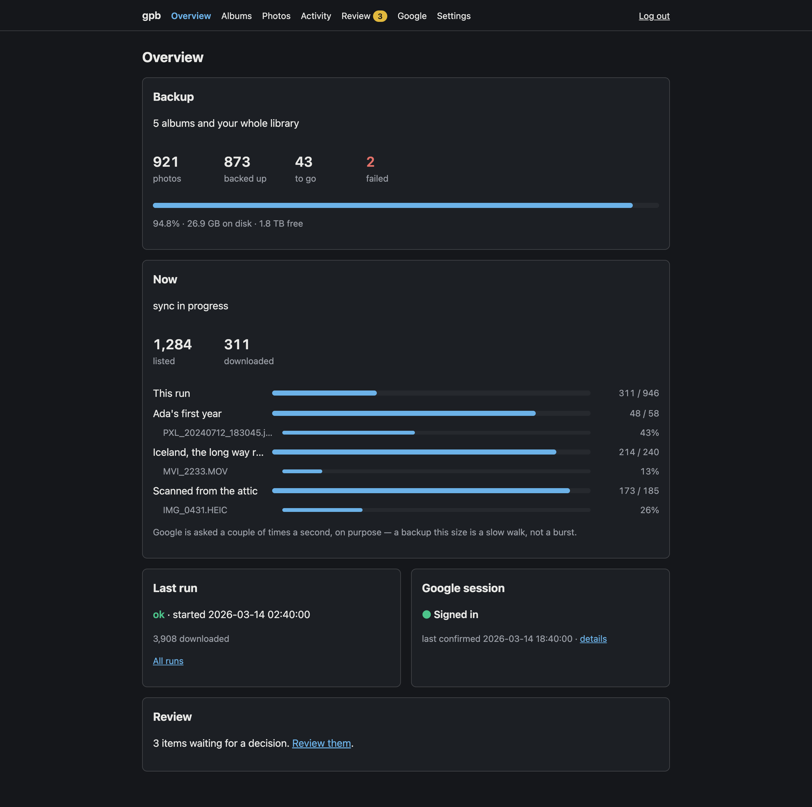
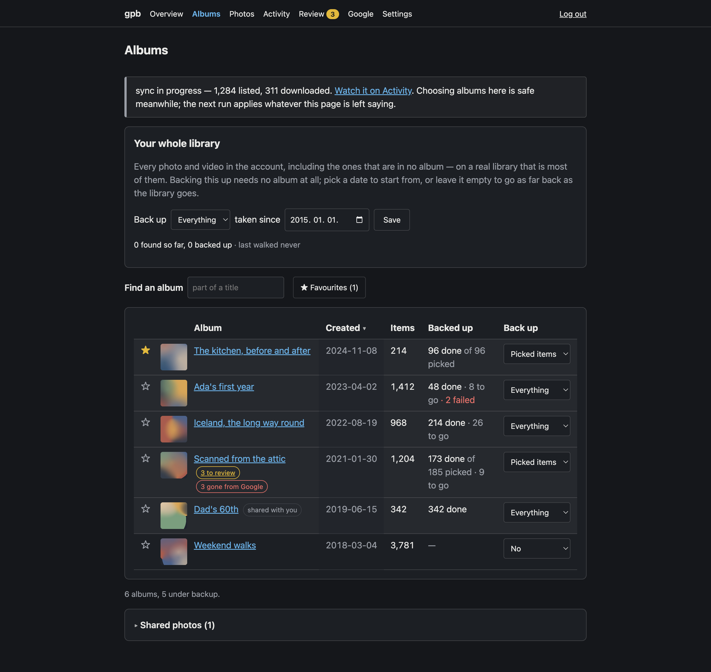
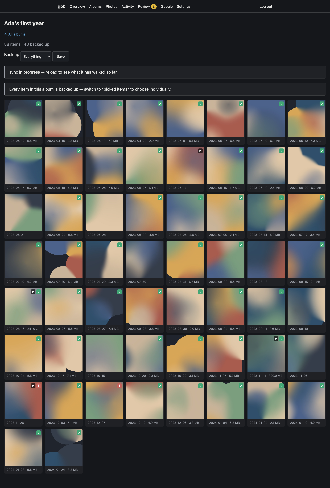
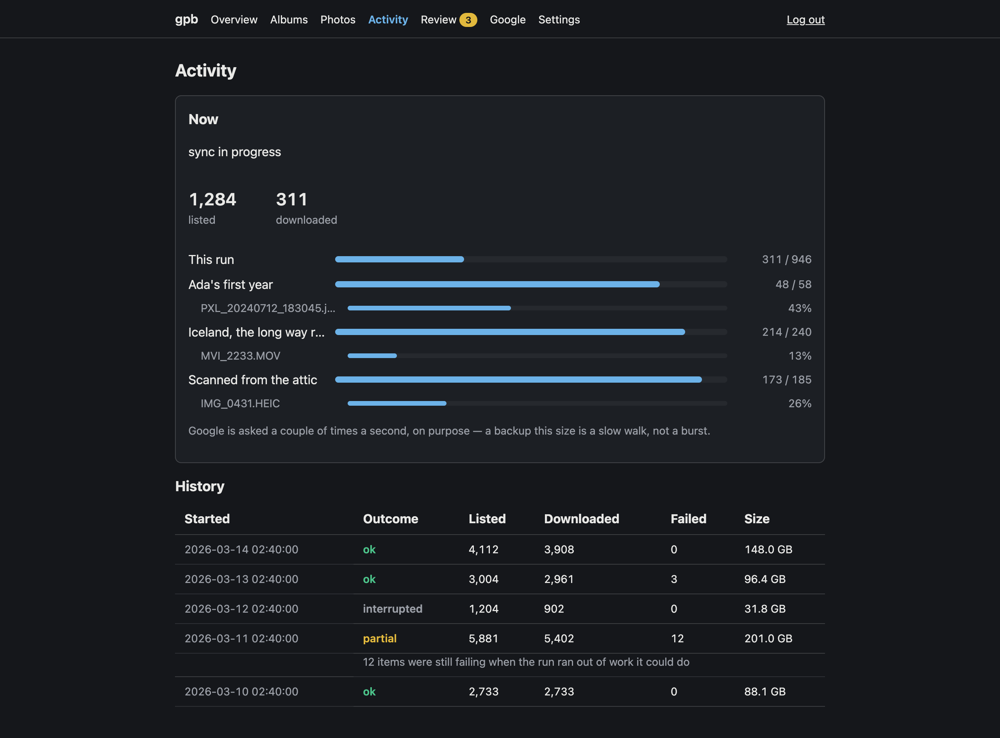
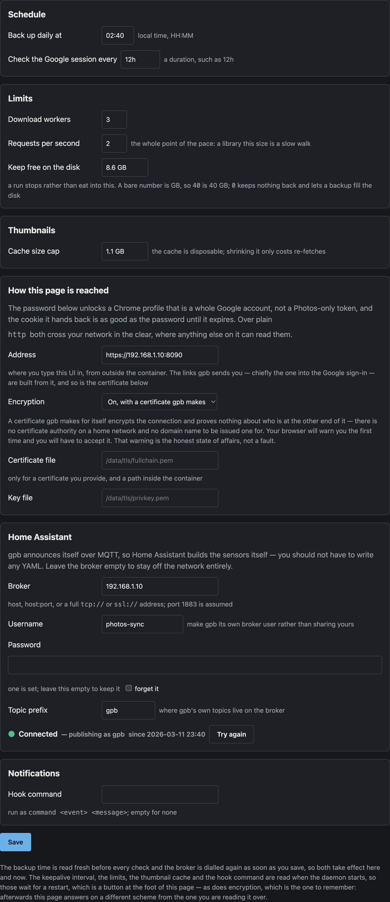

# gpb — Google Photos backup

A small always-on appliance that copies a Google Photos library to a disk you own, and gives
you a web page to decide what it copies. It drives a real signed-in browser session rather
than the Library API, whose read scopes Google removed on 31 March 2025.



The design and the reasoning behind it live in [DESIGN.md](DESIGN.md). This file is the short
tour.

## What it does

- **Backs up on a schedule**, once a day, resuming a run that was cut off rather than starting
  the day again. Files land in a pool laid out by capture date, with EXIF and GPS untouched and
  videos untranscoded, and `<photos>/albums/` is a symlink view so the backup is browsable in a
  file manager.
- **Curation is the point.** Follow an album in full, follow only items you pick, or leave it
  alone. Whole-library backup is one switch, with an optional "taken since" date.
- **Shows you the photographs while you choose**, including the ones it has deliberately not
  downloaded: thumbnails are fetched through the daemon and cached, because the browser has no
  Google session and must never be given one.
- **Says what it is doing** — a live progress block per album and per file while a run works,
  a history of past runs with counts, bytes and outcomes, and a review queue for items that
  appeared in a picked album after you curated it.
- **Survives Google's session expiry** by warming the session on a schedule and, when that is
  no longer enough, letting you sign in through an embedded browser from your phone without
  touching the server.
- **Reports to Home Assistant** over MQTT, building its own entities through MQTT Discovery.

## Choosing what to back up

Every album the account can see, with what has been backed up out of each, and one selector per
row. Followed albums sort to the top until you click a heading; the 49 nameless bundles of shared photos are collapsed
into a section of their own; a picked album with nothing picked earns a badge, because that is
the one state that looks followed and backs up nothing.



Nothing here needs Google to be reachable. The list, the counts and the thumbnails all come out
of the local database, and each album has a "Refresh from Google" of its own for when you want
it to be current.

## Picking individual photos



Click to pick, shift-click for a range, or select the whole album server-side without the
browser ever handling every key. Selections live in the database, so paging through a
ten-thousand-item album never loses them. Each cell says what state its item is in: backed up,
failed, waiting for a decision, gone from Google, or a video.

## Watching it work



The live block is the run happening now — what it has listed, what it has downloaded, and the
file each worker is partway through. Below it is every run that came before, including the ones
that went badly: an interrupted run and a partial one say so, and a partial one says what was
still failing when it ran out of work it could do.

## Settings, and Home Assistant



Name a broker and the daemon publishes what the backup is doing using Home Assistant's own MQTT
Discovery, so nothing has to be written in YAML at the other end: twelve sensors, two buttons
(back up now, refresh albums) and a library selector arrive as one device. A button pressed on a
dashboard goes through the same runner as the button on the page, and is refused by the same
one-run-at-a-time rule.

The broker is dialled again the moment you save, and the connection line above says how that
went — including what the broker said when it refused, which is almost always a credential the
broker does not know rather than a network it cannot reach. "Try again" re-dials without changing
anything, for the broker that was simply down.

The page can also be served over https, which matters more here than on most home appliances: the
password it takes unlocks a Chrome profile that is a whole Google account rather than a
Photos-scoped token, and the cookie it hands back is as good as the password. Off by default, so
an install that upgrades into it answers where it always did. Chosen, gpb writes itself a
certificate for the address in that same box — there is no certificate authority on a home network
and no domain name to be issued one for, so the browser warns once and you accept it, which
encrypts the wire and proves nothing about who is at the far end. A certificate from somewhere
else can be pointed at instead; either way it is tried when you save rather than at the next
start, because a daemon that will not listen is a daemon whose settings page cannot be reached to
correct it.

Encryption, like the schedule and the limits, is read once when the daemon starts, so the page ends
with a Restart button — which is also the only way to reach a setting whose whole effect is that
the page moves to another address. It stops the daemon and leaves starting it again to whatever
runs it, so it appears only in a container, where something does.

## Running it

Two guides. You want one of them, not both.

**[Docker Compose](deploy/compose.md)** — pull and up:

```bash
curl -O https://raw.githubusercontent.com/sodre90/gpb/main/docker-compose.yml
mkdir -p data photos && chmod 700 data && sudo chown 1000:1000 data photos
docker compose up -d
docker compose exec gpb gpb passwd    # then open http://localhost:8090/
```

**[Rootless Podman + systemd Quadlet](deploy/quadlet.md)** — what this actually runs on: systemd
owns the lifecycle, the pool stays owned by your login user, and it comes back after a reboot.

The image is [`sodre90/gpb`](https://hub.docker.com/r/sodre90/gpb), linux/amd64, and it carries no
Google Chrome: the container fetches Chrome from Google into its own data volume the first time it
starts, which is why that volume wants about a gigabyte free and why the first start takes a minute
longer than the rest. The Licence section says why it is done that way. Locally, without a
container at all:

```bash
export GPB_DATA_DIR=./data
go run ./cmd/gpb passwd     # set the web password
go run ./cmd/gpb daemon     # serves http://localhost:8080
```

There is a command line too, which does everything the daemon's own scheduler does:

```
gpb daemon                 run the web UI and the session keepalive loop
gpb status [--healthcheck] report the Google session state of a running daemon
gpb passwd                 set the web UI password
gpb version                print the release this binary was built from

gpb albums [--local]       list the albums, refreshing from Google unless --local
gpb follow <id> [--mode all|picked]
                           back up an album; ids may be shortened to any unique prefix
gpb unfollow <id>          stop backing up an album
gpb sync [--limit N]       run one backup pass now
gpb links                  rebuild <photos>/albums/, the symlink view of the pool
gpb verify [--repair]      re-read the backed-up files and check them against their hashes
```

`verify` is the one nothing else does: a run notices a file that has *gone*, but a file quietly
rotted by a failing disk keeps its name, its size and its place in the pool, and only re-reading
it says so. It exits non-zero when it found anything, so a monthly cron entry needs no output
parsing to notice; `--repair` puts the damaged files back on the work list for the next run to
fetch again, and deletes nothing.

Browser login works on macOS too, with one difference: instead of the embedded noVNC canvas,
Chrome opens on your own screen and the web UI tells you to sign in there and come back. The VNC
chain is skipped because macOS Chrome is a Cocoa app that cannot render into an X display at all.
Chrome is found automatically under `/Applications`; point `GPB_CHROME_PATH` at it if you keep it
elsewhere.

Requires Go 1.26.4 or later.

## Configuration

One file, `$GPB_DATA_DIR/config.toml`, written with defaults on first run. Everything has a
default except the web password, so a fresh install needs `gpb passwd` and nothing else. The
backup time, the broker settings and the password are re-read from the file as they are used, so
editing those on the settings page takes effect straight away; the keepalive interval, the limits,
the thumbnail cache and the notify hook are read when the daemon starts. `GPB_DATA_DIR`, `GPB_PHOTOS_DIR`,
`GPB_CHROME_PATH`, `GPB_NOVNC_DIR` and `TZ` are the only environment overrides. One further variable is
read but is hardly yours to set: `container`, which Podman sets itself and the compose file sets for
Docker, and which is how the settings page knows a Restart would be followed by a start.

See [DESIGN.md §12](DESIGN.md) for the annotated file.

## Three things worth knowing before you run it

- **The profile directory is a full Google account credential**, not a Photos-scoped token.
  Anyone who can read `$GPB_DATA_DIR/profile` can read the account's Gmail. Mode 0700 and a
  non-root container are the actual boundary; see DESIGN.md §15.
- **Encryption is off by default**, so until you turn it on the password and the session cookie
  cross the LAN in the clear — and that cookie opens an interactive, fully authenticated Google
  browser. Off is the right default for an appliance that has to answer somewhere before it can
  be configured at all, and the wrong setting to leave alone if anything on the network is not
  yours. Settings → Encryption, then Restart.
- **Google does not offer this.** There has been no supported way to read your own library since
  the Library API's read scopes went, so gpb drives the same private endpoints the Photos website
  drives, with a session you signed into yourself. They are undocumented and can change without
  notice: a run that breaks after such a change is the expected failure mode rather than a
  surprise. Whether an account is ever challenged for looking automated is Google's call, and
  nothing here can promise otherwise. Your library, your hardware — and your account risk.

## Layout

```
cmd/gpb/                 daemon | status | passwd | albums | follow | unfollow | sync | links | verify
internal/auth/           chromedp warmup, session export, headful re-auth stack
internal/config/         config.toml: defaults, validation, the password hash
internal/gphotos/        the batchexecute protocol: listings, downloads, thumbnails
internal/store/          SQLite: albums, items, selections, runs
internal/syncer/         the backup run itself — listing, download, resume, retry
internal/engine/         assembling a run: warm the profile, harvest the session, wire the syncer
internal/links/          <photos>/albums/, the symlink view of the pool
internal/thumbs/         thumbnail fetch and disk cache
internal/web/            every page, its templates and its stylesheet
internal/homeassistant/  the MQTT bridge and its discovery messages
internal/daemon/         scheduler, keepalive, notify hook, wiring
deploy/                  the two installation guides, the Quadlet unit, the image's entrypoint
design/                  the web design brief, and static previews of every page
docs/                    the screenshots this README shows
spike/                   Phase 0 throwaway protocol spike (separate Go module)
```

## Tests, and these pictures

```bash
go test ./...              # main module
cd spike && go test ./...  # spike module
```

The screenshots above are the real pages — the same handlers, templates and stylesheet the
daemon serves — photographed against an invented library: made-up album titles, made-up
filenames, and thumbnails painted in the test rather than photographed anywhere. Nobody's albums
or photographs belong in a repository, and inventing the library rather than blurring a real one
leaves nothing to redact. To redraw them:

```bash
GPB_SCREENSHOTS=1 go test ./internal/web/ -run Screenshots
```

A couple of tests drive a browser rather than reading markup, because whether a photograph fits
the window, or whether starring an album reloaded the page under the reader, are questions no
rendered HTML answers. They are skipped by default, for the same reason as the pictures — they
want a Chrome:

```bash
GPB_BROWSER=1 go test ./internal/web/ -run 'Viewer|AlbumsPage'
```

## Where it has got to

Backing up, curation, the review queue, the run history, the settings page, the scheduler,
notifications and the Home Assistant bridge are all built and running against a real library of
around 96,000 items across 181 albums. The two gaps 0.1.0 shipped with are closed: `gpb verify`
re-reads what is on disk, and the daemon takes a weekly copy of its database beside it.

## Licence

[Apache-2.0](LICENSE), copyright 2026 perdos.

Not affiliated with, endorsed by or sponsored by Google LLC. "Google Photos" and "Google Chrome"
name the things this talks to, and nothing more.

The published image contains no part of Google Chrome, which is not free software and is not ours
to hand on. The container downloads it from Google's own server into its data volume the first
time it starts, so what is redistributed here is this project, and Chrome reaches you from Google
under the terms you accept there — as it would installing it on a laptop. Chromium would avoid the
question entirely and does not work: the reason, measured, is in
[deploy/README.md](deploy/README.md).
